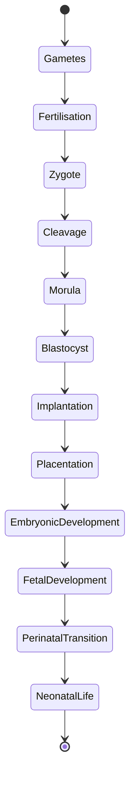
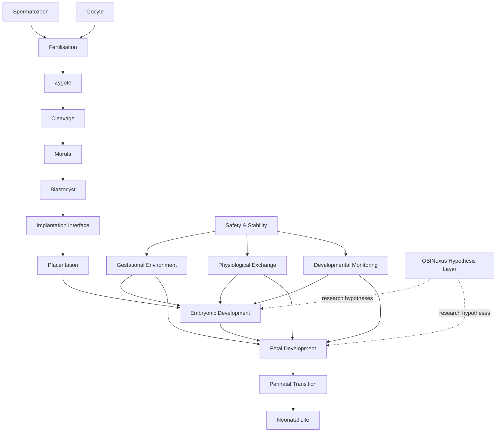

# OBINexus Artificial Gestation System (AGS)

## Biological Systems Model v0.2

**Project:** OBINexus Tier 3C — Biological Systems
**System:** Artificial Gestation System (AGS)
**Document class:** Scientific terminology and conceptual systems architecture
**Status:** Research model — not a clinical or experimental protocol

---

# 1. Purpose

The Artificial Gestation System (AGS) is modelled as a collection of biological and engineered subsystems concerned with:

1. gamete production and acquisition;
2. fertilisation;
3. preimplantation development;
4. implantation and placentation;
5. embryonic development;
6. fetal growth and maturation;
7. maintenance of an extrauterine gestational environment;
8. transition from fetal to neonatal physiology.

The model deliberately separates:

* **established reproductive biology**;
* **engineering requirements inferred from that biology**; and
* **OBINexus hypotheses**, including consciousness or persona-related models.

This separation prevents speculative concepts from being represented as established biological mechanisms.

---

# 2. Core Biological Terminology

## 2.1 Gametes

A **gamete** is a haploid reproductive cell.

The two human gametes are:

* **spermatozoon** — male gamete;
* **oocyte** — female gamete.

Their fusion during fertilisation produces a **zygote**.

---

# 3. Male Gamete System

The term “sperm producer” can be replaced with the following biological model.

```text
Male Reproductive System
        │
        ▼
      Testes
        │
        ├── Spermatogenesis
        │       │
        │       ▼
        │   Spermatozoa
        │
        ▼
    Epididymis
        │
        ├── maturation
        └── storage
        │
        ▼
   Vas deferens
        │
        ▼
 Ejaculatory pathway
```

## 3.1 Testes

The **testes** are the primary male gonads.

Their relevant functions include:

* production of sperm through **spermatogenesis**;
* production of androgenic hormones, particularly testosterone.

## 3.2 Epididymis

The **epididymis** is associated with sperm maturation, transport and storage.

It should not be confused with the testis itself.

## 3.3 Scrotum

The **scrotum is not a sperm-producing organ**.

It is the external sac containing the testes and associated structures and contributes importantly to **testicular thermoregulation**.

Therefore, in AGS terminology:

```text
Incorrect:
Scrotum = sperm producer

Correct:
Testis = sperm-production organ
Spermatogenesis = sperm-production process
Epididymis = sperm maturation/storage structure
Scrotum = protective and thermoregulatory compartment
```

---

# 4. Female Gamete System

The transcript's proposed “egg producer” can be expressed biologically as the **ovarian follicle–oocyte system**.

```text
Female Reproductive System
        │
        ▼
      Ovary
        │
        ├── follicular development
        │
        └── oocyte maturation
        │
        ▼
     Ovulation
        │
        ▼
  Uterine tube
        │
        ├── oocyte transport
        └── typical site of fertilisation
        │
        ▼
      Uterus
        │
        ▼
   Endometrium
        │
        ▼
   Implantation
```

## 4.1 Ovary

The **ovary** is the female gonad.

It contains ovarian follicles within which oocytes develop and mature.

The release of an oocyte from an ovarian follicle is called **ovulation**.

## 4.2 Uterine Tube

The **uterine tube**, also called the **Fallopian tube** or **oviduct**, transports the oocyte toward the uterus.

Fertilisation commonly occurs within the ampullary portion of the uterine tube.

## 4.3 Uterus

The **uterus** supports implantation and subsequent embryonic and fetal development.

## 4.4 Endometrium

The **endometrium** is the inner lining of the uterus.

Successful implantation requires interaction between the developing blastocyst and a receptive endometrium.

## 4.5 Cervix

The **cervix** is the lower portion of the uterus connecting the uterine cavity to the vagina.

It should be treated as a specialised reproductive structure rather than as the location of fertilisation or oocyte production.

---

# 5. Fertilisation System

Fertilisation is not a two-week developmental phase.

It is the biological process through which the spermatozoon and oocyte interact and ultimately form a new diploid cell:

**the zygote**.

The developmental sequence is more accurately represented as:

```text
Spermatozoon + Oocyte
          │
          ▼
     Fertilisation
          │
          ▼
        Zygote
          │
          ▼
       Cleavage
          │
          ▼
       Morula
          │
          ▼
      Blastocyst
          │
          ▼
     Implantation
```

The period following fertilisation therefore should not be labelled simply “fertilisation.”

It contains several distinct developmental processes.

---

# 6. Developmental State Model

AGS should adopt a developmental state machine rather than the existing three compressed phases.



This gives AGS a biologically meaningful sequence:

### AGS-B0 — Gamete State

Spermatozoon and oocyte exist independently.

### AGS-B1 — Fertilisation

Gamete interaction results in formation of the zygote.

### AGS-B2 — Preimplantation Development

Development progresses through cleavage, morula and blastocyst stages.

### AGS-B3 — Implantation

The blastocyst establishes interaction with the implantation environment.

### AGS-B4 — Placentation

Trophoblast-derived tissues and maternal tissues establish the biological exchange interface associated with the developing placenta.

### AGS-B5 — Embryonic Development

Gastrulation, body-plan formation, neurulation and organogenesis progressively establish the developing organism.

### AGS-B6 — Fetal Development

Existing organ systems undergo continued growth, differentiation and functional maturation.

### AGS-B7 — Perinatal Transition

The organism transitions from fetal physiology toward independent neonatal physiology.

---

# 7. Placental Interface

For mammalian artificial gestation, the central systems-engineering problem is not simply building an “incubator.”

The placenta performs multiple interacting biological functions.

Conceptually:

```text
Maternal System
      │
      ▼
Placental Interface
      │
      ├── Gas exchange
      ├── Nutrient exchange
      ├── Metabolite/waste exchange
      ├── Endocrine signalling
      ├── Immunological interaction
      └── Physiological regulation
      │
      ▼
 Umbilical Circulation
      │
      ▼
Embryo / Fetus
```

An artificial gestational system therefore cannot treat the placenta as merely a food pump.

A future full ectogenesis platform would need to reproduce or substitute enough of these functions to sustain normal development.

---

# 8. Gestational Environment

The current repository term **“vacuum chamber” should not be interpreted as a literal physical vacuum**.

Human embryos and fetuses do not normally develop in a vacuum.

For the scientific architecture, use:

**Extrauterine Gestational Environment — EGE**

or the established research terminology:

**Artificial Womb Technology — AWT**

and

**Ex-vivo Uterine Environment — EVE**

where appropriate.

The OBINexus term **Vacuum** may still be retained as a philosophical abstraction meaning environmental isolation.

The engineering concept becomes:

```text
OBI "Vacuum"
    =
controlled isolation from unwanted external variation

NOT

physical vacuum pressure
```

---

# 9. Extrauterine Gestational Environment

The AGS environment can be decomposed conceptually into:

```text
┌───────────────────────────────────────┐
│ EXTRAUTERINE GESTATIONAL ENVIRONMENT │
│                                       │
│  Fluid Environment                    │
│          │                            │
│          ▼                            │
│  Developing Organism                 │
│          │                            │
│          ▼                            │
│  Umbilical / Exchange Interface      │
│          │                            │
│          ▼                            │
│  Physiological Support System        │
│                                       │
├───────────────────────────────────────┤
│ Thermal regulation                    │
│ Gas exchange                          │
│ Nutrient exchange                     │
│ Waste/metabolite management           │
│ Fluid homeostasis                     │
│ Physiological monitoring              │
│ Infection-control boundary            │
│ Fault detection                       │
│ Safety systems                        │
└───────────────────────────────────────┘
```

This architecture is closer to mammalian gestational physiology than the model of a heated incubator.

---

# 10. Avian Reference Model

Bird development remains useful as a **comparative model**, but mammalian and avian gestation must not be treated as equivalent systems.

For chickens:

```text
Mating
  ↓
Sperm enters female reproductive tract
  ↓
Ovulation
  ↓
Internal fertilisation in oviduct
  ↓
Egg components/shell formed
  ↓
Egg laid
  ↓
Incubation
  ↓
Embryonic development
  ↓
Hatching
```

Therefore:

**incubation does not fertilise the chicken egg.**

Incubation provides environmental conditions required for continued development of an already-fertilised egg.

The useful AGS lesson from birds is instead:

> A developing vertebrate can, in principle, exist within a bounded extra-organismal developmental environment when that environment supplies the biological conditions appropriate to that species.

The avian egg itself provides nutrients, water, protection and specialised extraembryonic structures.

Mammalian gestation uses a substantially different placental strategy.

---

# 11. AGS Functional Decomposition

The biological system can therefore be represented using eight major functional modules.

```text
AGS
│
├── GMS — Gamete Management System
│
├── FES — Fertilisation & Early-development System
│
├── IPS — Implantation & Placentation System
│
├── GES — Gestational Environment System
│
├── PXS — Physiological Exchange System
│
├── DMS — Developmental Monitoring System
│
├── SSS — Safety & Stability System
│
└── PTS — Perinatal Transition System
```

### GMS — Gamete Management System

Biological objects:

* spermatozoon;
* oocyte.

Biological processes:

* spermatogenesis;
* oogenesis;
* follicular maturation;
* ovulation.

---

### FES — Fertilisation & Early-development System

States:

```text
gametes
→ fertilisation
→ zygote
→ cleavage
→ morula
→ blastocyst
```

---

### IPS — Implantation & Placentation System

Represents the transition from a free preimplantation conceptus to a biologically integrated gestational system.

This is distinct from fertilisation.

---

### GES — Gestational Environment System

Represents the controlled developmental compartment.

Functions conceptually include:

* fluid environment;
* physical protection;
* environmental stability;
* thermal regulation.

---

### PXS — Physiological Exchange System

Represents functions normally associated particularly with the maternal–placental–fetal interface.

Conceptual responsibilities:

* oxygen/carbon-dioxide exchange;
* nutrient transport;
* metabolite removal;
* fluid/electrolyte regulation;
* endocrine interaction.

---

### DMS — Developmental Monitoring System

Observes biological state without assuming that every detected variation is a defect.

Possible state categories:

```text
EXPECTED
VARIANT
UNCERTAIN
ABNORMAL
CRITICAL
```

This is biologically preferable to:

```text
PERFECT / DEFECTIVE
```

because normal human development contains substantial biological variation.

---

### SSS — Safety & Stability System

Provides systems-engineering supervision.

Conceptually:

```text
observe
→ validate
→ detect deviation
→ classify
→ escalate
```

The biological model should not automatically equate detection of genomic variation with a command to “correct” the organism.

---

### PTS — Perinatal Transition System

Represents the transition between:

```text
fetal physiology
        ↓
birth / removal from gestational support
        ↓
neonatal physiology
```

This is a major physiological transition, not merely removal from a chamber.

---

# 12. Full Ectogenesis vs Partial Ectogestation

AGS should distinguish two different research goals.

## Partial Ectogestation

Continuation of fetal development outside the uterus while attempting to preserve fetal physiology.

Conceptually:

```text
In-utero pregnancy
       ↓
transfer
       ↓
extrauterine fetal support
       ↓
neonatal transition
```

## Full Ectogenesis

Development occurring artificially across essentially the complete gestational process.

Conceptually:

```text
fertilisation
    ↓
preimplantation development
    ↓
implantation equivalent
    ↓
placentation equivalent
    ↓
embryonic development
    ↓
fetal development
    ↓
birth
```

These are not technologically equivalent problems.

---

# 13. Current Scientific Boundary

Current artificial-womb research should not be represented as evidence that complete human ectogenesis has already been achieved.

Existing major experimental systems have concentrated on **extrauterine support of fetal animals**, particularly premature lamb models, using fluid-filled environments and extracorporeal gas-exchange support.

The unresolved leap from those systems to complete ectogenesis includes the earliest developmental stages, implantation, placentation and maintenance of the full developmental programme.

Therefore AGS should classify:

```text
Partial extrauterine fetal support
    = demonstrated preclinical research domain

Complete human ectogenesis
    = research hypothesis / future engineering objective
```

---

# 14. Scientific-Hypothesis Boundary

The following concepts currently present in AGS documentation should remain part of OBINexus research philosophy but should **not be represented as established embryology**:

* sperm or oocyte consciousness;
* consciousness beginning before fertilisation;
* direct encoding of parental memories into gametes;
* biological encoding of multiple personas;
* filtering “negative memories” from an embryo;
* guaranteed genetic perfection;
* guaranteed elimination of congenital anomalies;
* universal real-time correction of genetic variation;
* accelerated human gestation to 20–24 weeks;
* accelerated organogenesis as an assumed improvement;
* generational genetic rollback.

These may each be expressed formally as:

```text
HYPOTHESIS
    ↓
MECHANISM REQUIRED
    ↓
PREDICTION
    ↓
TESTABLE EVIDENCE
    ↓
SUPPORTED / UNSUPPORTED / UNRESOLVED
```

This allows the OBI research framework to coexist with conventional biology without confusing the two.

---

# 15. Recommended AGS Scientific Architecture



---

# 16. Terminology Mapping

| Earlier AGS wording              | Biological / engineering terminology                                          |
| -------------------------------- | ----------------------------------------------------------------------------- |
| sperm producer                   | testes / spermatogenesis                                                      |
| sperm storage                    | epididymis, particularly epididymal storage                                   |
| scrotum produces sperm           | incorrect — scrotum supports protection and thermoregulation                  |
| egg producer                     | ovary / ovarian follicle / oogenesis                                          |
| egg                              | oocyte before fertilisation                                                   |
| fertilised egg                   | zygote / conceptus depending on developmental stage                           |
| egg tube                         | uterine/Fallopian tube or oviduct                                             |
| fertilisation chamber            | fertilisation environment                                                     |
| womb                             | uterus                                                                        |
| womb lining                      | endometrium                                                                   |
| baby during earliest development | zygote / embryo / conceptus as appropriate                                    |
| vacuum chamber                   | extrauterine gestational environment                                          |
| artificial womb                  | AWT / EVE / ectogestation system depending on scope                           |
| genetic perfection               | genomic integrity / developmental health, with uncertainty                    |
| defect scanner                   | developmental anomaly monitoring                                              |
| genetic error                    | genetic variant / pathogenic variant / chromosomal abnormality as appropriate |
| split                            | cleavage when referring to normal early cell division                         |
| birth-ready                      | transition/readiness assessment                                               |
| artificial complete pregnancy    | full ectogenesis                                                              |
| continuation outside womb        | partial ectogestation                                                         |

---

# 17. Central AGS Biological Principle

The scientific AGS model can be reduced to one statement:

> **Artificial gestation is not the simulation of a container. It is the substitution, preservation, or engineering of the interacting biological functions that normally sustain embryonic and fetal development.**

Therefore:

```text
AGS ≠ incubator alone

AGS =
developmental environment
+
exchange physiology
+
developmental biology
+
placental-interface biology
+
homeostasis
+
monitoring
+
safety
+
developmental transition
```

This becomes the biological foundation upon which the wider OBINexus Tier 3C architecture can be built.
